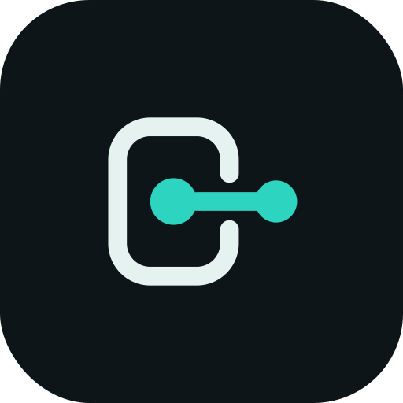
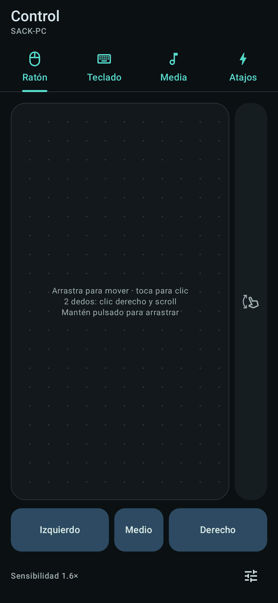

<p align="center"></p>

# PC Remote

**Tu Command Center personal**: controla, monitoriza y administra tu PC con Windows desde el móvil Android, en la misma red local.

Energía, métricas en vivo (CPU, RAM, GPU, discos, red), ratón y teclado, multimedia, apps, procesos, ventanas, archivos, terminal, red y portapapeles con historial e imágenes. Todo cifrado y emparejado por dispositivo.

<p align="center">
  
  
  
</p>

---

## Empezar en 2 minutos

1. **En el PC**: descarga `PcRemote.exe` y ábrelo con doble clic. No hace falta instalar .NET ni escribir comandos.
   La primera vez se abre solo el panel con un código QR (Windows pedirá permiso de firewall: acéptalo en redes privadas).
2. **En el móvil**: instala `PcRemote.apk`, toca **Escanear QR** y apunta al panel.
3. Listo: la app entra directamente al panel de control de tu PC cada vez que la abres.

**¿Dónde descargo el exe y el APK?** Cada push compila los dos en GitHub Actions
(pestaña *Actions* → última ejecución de **build** → *Artifacts*:
`PcRemote-windows` y `PcRemote-android`). Al crear un tag `v*` se publican
además como *Release*.

Para compilarlos tú mismo, ver [Compilar](#compilar).

En la bandeja del sistema, el icono de PC Remote tiene **Iniciar con Windows**,
el acceso al panel, la carpeta de plugins y los registros. Abrir el exe una
segunda vez solo abre el panel.

---

## Qué hay

| Parte | Qué es |
|---|---|
| **`agent/`** | App de bandeja para Windows en **.NET 10** (C#), distribuida como un único `PcRemote.exe`. WebSocket seguro (`wss://`), anuncio por mDNS, panel web de administración en `localhost` y **plugins**. |
| **`android/`** | App nativa en **Kotlin + Jetpack Compose + Material 3**: tema oscuro y claro, móvil y tablet. |

### La app

- **Inicio**: estado del PC de un vistazo (en línea, latencia, IP, tiempo encendido), acciones rápidas (bloquear, suspender, reiniciar, apagar… con confirmación), métricas en tiempo real con gráficas, herramientas e info del equipo.
- **Control**: touchpad (gestos, arrastrar, franja de scroll para usarlo con una mano), teclado con modificadores, multimedia con carátula y volumen, atajos.
- **Apps**: lanzador en rejilla con iconos reales, favoritas y recientes; abrir, enfocar y cerrar. Procesos (CPU, RAM, finalizar) y ventanas.
- **Actividad**: línea de tiempo de conexiones, comandos y alertas.
- **Herramientas**: Terminal (PowerShell / cmd), Archivos (explorar, abrir en el PC, bajar al móvil), Red (interfaces, conexiones, ping desde el PC), Portapapeles (**todo el historial del PC, con imágenes**, y enviar texto o imágenes al PC).
- **Ajustes**: tema, colores dinámicos, vibración, confirmaciones, desbloqueo biométrico, dirección del PC, plugins.
- Reconexión automática al volver a la app, aunque Android la haya congelado; si el PC cambió de IP lo vuelve a encontrar por mDNS. Wake-on-LAN para encenderlo.

### Plugins

Cada función es un plugin que se activa o desactiva desde el panel del PC; también se pueden añadir DLL externas. La **Terminal viene desactivada**. Ver [`docs/PLUGINS.md`](docs/PLUGINS.md).

---

## Seguridad

- Emparejamiento por QR (con la huella del certificado) o código de 6 dígitos; clave **Ed25519 por dispositivo**; certificado autofirmado **fijado** (*pinning*).
- **Comandos tipados**, nunca "ejecuta este string" — salvo el plugin Terminal, apagado por defecto y activable solo desde el PC.
- El agente corre como tu usuario, nunca como administrador. Revocación inmediata desde el panel.
- El panel solo escucha en `localhost` y rechaza DNS rebinding y CSRF.
- El historial del portapapeles vive solo en memoria y respeta lo que los gestores de contraseñas marcan como privado.

Detalles en [`docs/PAIRING.md`](docs/PAIRING.md) y [`docs/ARCHITECTURE.md`](docs/ARCHITECTURE.md).

---

## Compilar

### Agente → `PcRemote.exe`

Necesita el **SDK de .NET 10** (para compilar; el exe resultante no lo necesita).

```powershell
cd agent
.\build-exe.ps1            # tests + agent\publish\PcRemote.exe
```

Para desarrollar: `dotnet run --project src/PcRemote.Agent` y `dotnet test PcRemote.Agent.slnx`.

Datos en `%LOCALAPPDATA%\PcRemote\`: `agent.db` (dispositivos y auditoría), `cert.pfx` + `cert.pass` (certificado TLS, contraseña cifrada con DPAPI), `plugins.json`, `plugins\` y `logs\`.
La configuración por defecto va dentro del exe; para cambiarla crea `%LOCALAPPDATA%\PcRemote\appsettings.json` solo con las claves que quieras cambiar (ver `agent/src/PcRemote.Core/Config/appsettings.defaults.json`).

| Puerto | Uso | Alcance |
|---|---|---|
| 47820 | `wss://…/ws`, protocolo del móvil | LAN |
| 47810 | Panel web | solo `localhost` |

### Android → APK

Ver [`android/README.md`](android/README.md).

---

## Documentación

- [`docs/ARCHITECTURE.md`](docs/ARCHITECTURE.md) — componentes, concurrencia, seguridad.
- [`docs/PROTOCOL.md`](docs/PROTOCOL.md) — protocolo WebSocket y **todos los comandos**.
- [`docs/PLUGINS.md`](docs/PLUGINS.md) — plugins integrados y cómo escribir uno.
- [`docs/PAIRING.md`](docs/PAIRING.md) — emparejamiento, autenticación, revocación.
- [`docs/APIS.md`](docs/APIS.md) — APIs de Windows por módulo.
- [`docs/ROADMAP.md`](docs/ROADMAP.md) — fases.
- [`assets/brand/`](assets/brand) — logotipo (SVG) e icono.

## Estructura

```
pc-remote/
├── .github/workflows/build.yml     # PcRemote.exe + PcRemote.apk en cada push; Release con tags v*
├── assets/brand/                   # marca: mark.svg, app-icon.svg
├── docs/
├── agent/                          # .NET 10
│   ├── build-exe.ps1               # → agent/publish/PcRemote.exe
│   ├── src/
│   │   ├── PcRemote.Agent/         # exe de bandeja, icono, Iniciar con Windows, perfil de publicación
│   │   ├── PcRemote.Core/          # WebSocket, emparejamiento, plugins, actividad, panel web, mDNS, SQLite
│   │   └── PcRemote.Modules.*/     # System, SystemInfo, Input, Clipboard (+historial), Applications,
│   │                               # Processes, Windows, Media, Terminal, Files, Network
│   └── tests/PcRemote.Tests/
└── android/                        # Kotlin + Compose + Material 3
```

---

Hecho con 💻 por **Sack**.
