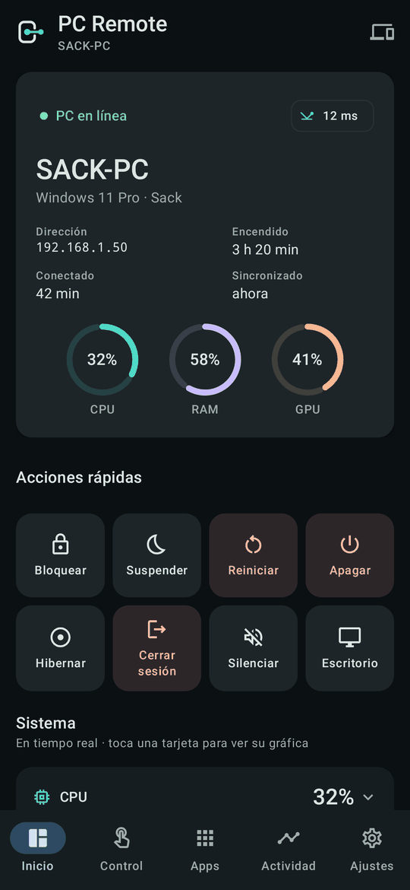
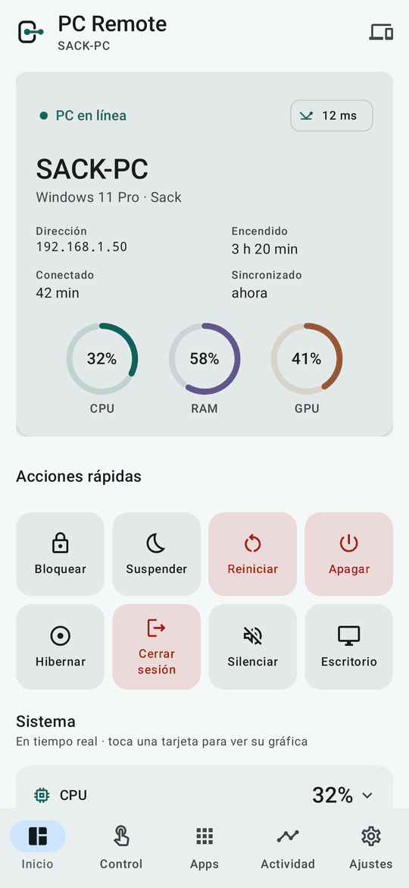
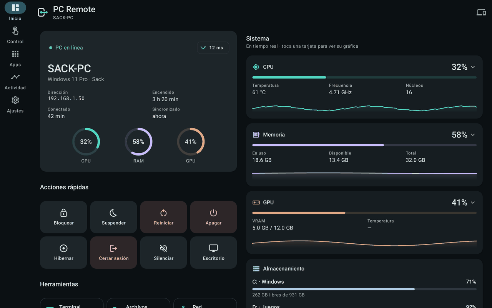

# PC Remote — Android (Kotlin + Jetpack Compose)

Cliente Android nativo. Sustituyó a la primera versión en React Native + Expo
(ya eliminada del repositorio), que sufría cierres opacos en release.

## Stack

- **Kotlin 2.4** (integrado en AGP 9) + **Jetpack Compose** (BOM 2026.09) + **Material 3**
  (con `material3-adaptive-navigation-suite`: barra en móvil, rail en tablet)
- Navigation Compose con rutas *type-safe*, ViewModel + StateFlow
- **OkHttp 5** para WSS, con *pinning* del certificado por SHA-256
- **BouncyCastle** para Ed25519 (Android Keystore solo lo soporta desde API 33)
- **NsdManager** para descubrimiento mDNS (`_pcremote._tcp`)
- **Android Keystore** (AES-256-GCM) para cifrar las credenciales de cada PC
- **androidx.biometric** para el desbloqueo con huella / cara / PIN (opcional)
- **kotlinx-serialization-json** para el protocolo

`compileSdk` 37, `targetSdk` 36, `minSdk` 26 (Android 8.0).

## Diseño

"Command Center personal": oscuro por defecto con un tema claro de verdad,
un teal técnico como color de marca y superficies grafito por capas
(`surfaceContainer*`), sin neón. Todo sale de `MaterialTheme.colorScheme` y
de `PcRemoteTheme.extended` (éxito, aviso y un color por métrica), nunca de
colores fijos en las pantallas.

| Oscuro | Claro | Tablet |
|---|---|---|
|  |  |  |

Pantallas: **Inicio** (estado, acciones rápidas, métricas con gráficas),
**Control** (ratón, teclado, multimedia, atajos), **Apps** (lanzador, procesos,
ventanas), **Actividad**, **Ajustes**, y desde Inicio **Terminal**,
**Archivos**, **Red** y **Portapapeles** (historial con imágenes). Cada
lista tiene estado de carga (*skeleton*), vacío y error con "Ver detalles".

## Conexión

- Una sola conexión por PC para todas las pantallas (`PcSession`).
- Al volver a la app se comprueba o rehace la conexión según el tiempo que
  estuvo fuera (Android congela las apps en segundo plano y el socket puede
  quedar muerto sin saberlo). Ping cada 5 s mientras está abierta.
- Si el PC cambió de IP se encuentra por mDNS (huella del certificado).
- No reintenta si el PC revocó el dispositivo o cambió de certificado.
- Las funciones cuyo plugin está desactivado en el PC lo dicen, en vez de
  fallar.

## Tests

```powershell
.\gradlew testDebugUnitTest   # QrPayload, WakeOnLan, errores de conexión, historial de métricas (JVM)
```

### Migración de credenciales (0.1.0 → 0.2.0)

Hasta 0.1.0 las credenciales se guardaban con `EncryptedSharedPreferences`
(`androidx.security:security-crypto`, deprecado). Desde 0.2.0 se cifran
directamente con una clave de Android Keystore. Al abrir la app, las
credenciales antiguas se copian al nuevo almacén y el fichero viejo se borra;
si algo falla, el fichero viejo se conserva. La dependencia `security-crypto`
solo sigue ahí para esa migración.

## Build

Requiere:

- **JDK 17 o 21**. Gradle 9.7 no arranca con JDK 26.
- Android SDK con la plataforma 37 (Gradle descarga lo que falte si las
  licencias están aceptadas).

```powershell
$env:JAVA_HOME = "C:\Program Files\Eclipse Adoptium\jdk-21.0.12.101-hotspot"
cd android
.\gradlew assembleDebug      # o assembleRelease
```

Si Gradle falla al descargar con `PKIX path building failed` (proxy o
antivirus que inspecciona HTTPS), haz que Java use el almacén de
certificados de Windows:

```powershell
$env:JAVA_TOOL_OPTIONS = "-Djavax.net.ssl.trustStoreType=WINDOWS-ROOT -Djavax.net.ssl.trustStore=NUL"
```

El APK queda en `app/build/outputs/apk/<debug|release>/`. El de release va
firmado con el keystore de debug.

## Debug con logcat

Con el móvil conectado por USB y la depuración activada:

```powershell
adb logcat | Select-String "PcRemote|AgentClient|CredentialsStore|AndroidRuntime"
```

## Estructura

```
android/app/src/main/
├── AndroidManifest.xml
├── res/  (icono adaptativo + monocromo, temas de arranque, FileProvider)
└── java/com/sack/pcremote/
    ├── MainActivity.kt, AppGraph.kt
    ├── net/        # Protocol, AgentClient, ConnectionProblem, Discovery, Crypto, QrPayload, WakeOnLan
    ├── session/    # PcSession (una conexión por PC), PcViewModel
    ├── data/       # CredentialsStore, SettingsStore, AppPrefs
    └── ui/
        ├── PcRemoteApp.kt            # navegación raíz
        ├── theme/                    # Color, Theme (+ colores extendidos), Type
        ├── components/               # tarjetas, gráficas, estados, háptica, marca…
        ├── lock/                     # desbloqueo biométrico
        ├── devices/                  # tus equipos, emparejar
        └── pc/                       # PcShell, ConnectionScreen y:
            ├── home/  control/  apps/  activity/  settings/
            └── tools/                # Terminal, Archivos, Red, Portapapeles
```
